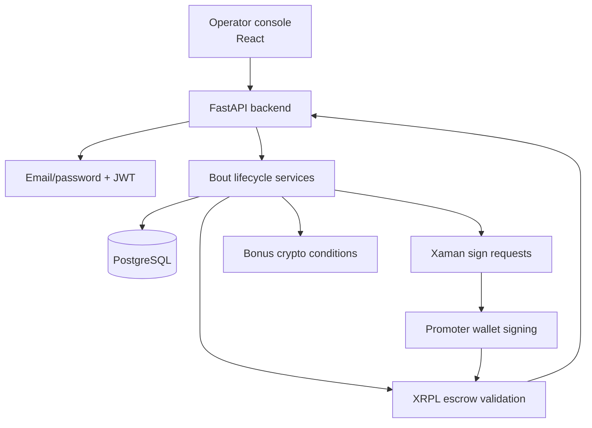
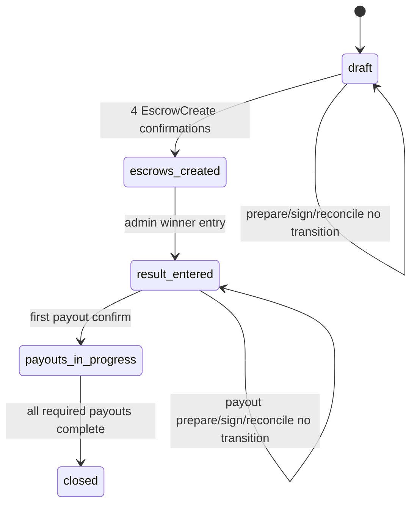
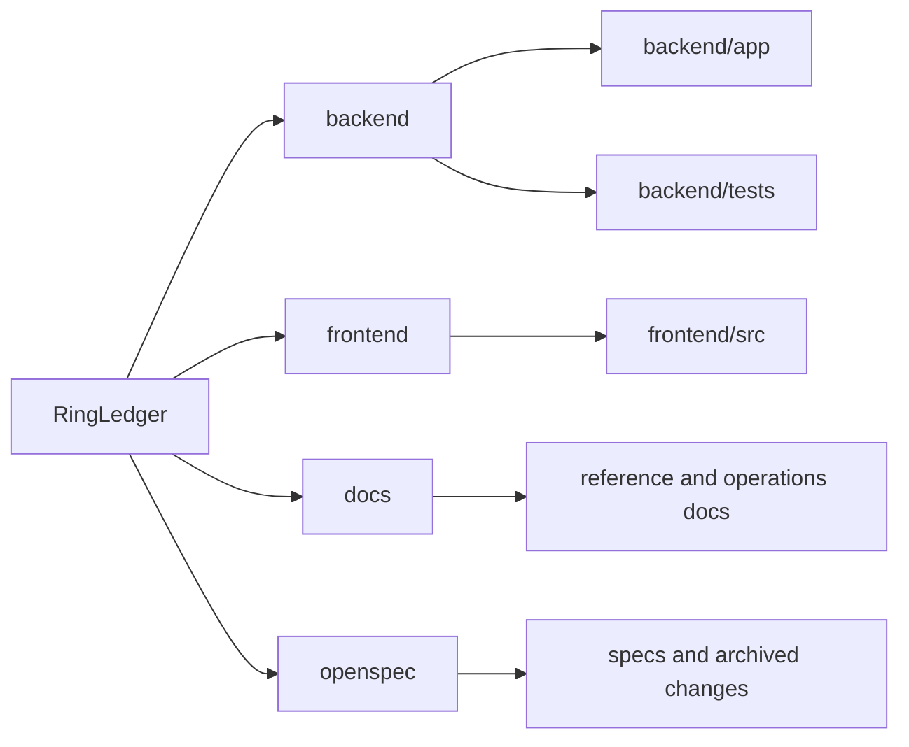

# RingLedger

RingLedger is an XRPL Testnet escrow settlement system for fighter purses. The locked MVP uses FastAPI, PostgreSQL, React, Xaman promoter signing, backend-enforced lifecycle guards, and XRP drops-only accounting.

## System At A Glance



## Current Status

- M1 through M4 functionality is implemented for the locked MVP/Testnet scope.
- The 2026-07-30 deterministic release-hardening work is implemented: backend-authoritative XRPL confirmation, secured privileged-role provisioning, locked setup, readiness gates, CI, and non-root container delivery.
- Live Xaman/XRPL smoke validation remains an operator-run release gate because it requires environment-managed credentials, funded Testnet accounts, and external network access.
- OpenSpec changes for release readiness and documentation overhaul are archived and synced into main specs.
- CI enforces backend tests, frontend tests, browser E2E, docs validation, and secret scanning.

## Locked MVP Scope

| Area | Constraint |
|---|---|
| Network | XRPL Testnet only |
| Auth | Email/password plus JWT only; no wallet login |
| Money | XRP drops as integers |
| Bout model | 1v1 with `show_a`, `show_b`, `bonus_a`, `bonus_b` escrows |
| Custody | Platform controls bonus fulfillment; promoter controls signatures |
| Signing | Xaman non-custodial signing; backend never stores promoter private keys |
| Timing | `FinishAfter = event_datetime_utc + 2h`; bonus `CancelAfter = event_datetime_utc + 7d` |
| Ledger truth | State transitions only after validated XRPL `tesSUCCESS` |
| Frontend trust | Frontend is advisory; backend enforces invariants |

## Lifecycle Overview



## Maintainer Documentation Map

Start at the README closest to the code you are changing. These module-local READMEs explain responsibility, flow, tests, and related contracts.

### Backend

| Module | README |
|---|---|
| Backend app overview | `backend/app/README.md` |
| HTTP routes | `backend/app/api/README.md` |
| Bout route modules | `backend/app/api/bouts_routes/README.md` |
| Config and security | `backend/app/core/README.md` |
| Crypto conditions | `backend/app/crypto_conditions/README.md` |
| Database and Unit of Work | `backend/app/db/README.md` |
| Pure domain rules | `backend/app/domain/README.md` |
| External integrations | `backend/app/integrations/README.md` |
| Middleware/request guards | `backend/app/middleware/README.md` |
| Persistence models | `backend/app/models/README.md` |
| Repositories | `backend/app/repositories/README.md` |
| API schemas | `backend/app/schemas/README.md` |
| Service layer | `backend/app/services/README.md` |
| Backend tests | `backend/tests/README.md` |

### Frontend

| Module | README |
|---|---|
| Frontend source overview | `frontend/src/README.md` |
| Typed API client | `frontend/src/api/README.md` |
| App shell | `frontend/src/app/README.md` |
| UI components | `frontend/src/components/README.md` |
| Workflow hooks | `frontend/src/hooks/README.md` |

## Canonical Reference Docs

| Contract | Document |
|---|---|
| Requirements | `docs/requirements-matrix.md` |
| API | `docs/api-spec.md` |
| Lifecycle states | `docs/state-machines.md` |
| Schema | `docs/schema-doc.md` |
| Traceability | `docs/traceability-matrix.md` |
| Operations | `docs/operations-runbook.md` |
| Operator flow | `docs/operational-flow.md` |
| Xaman signing | `docs/xaman-signing-contract.md` |
| Testnet release | `docs/testnet-release-readiness.md` |
| CI/CD | `docs/ci-cd.md` |

## Repository Layout



## Local Verification

```powershell
uv sync --locked --extra dev
uv run --locked --extra dev ruff check backend
uv run --locked --extra dev ruff format --check backend docs
uv run --locked --extra dev pytest backend/tests -q
cd frontend
npm ci
npm run typecheck
npm run test
npm run test:e2e
```

## Container Release Stack

Create `secrets/` files for `postgres_password.txt`, `database_url.txt`, `jwt_secret.txt`, `xaman_api_key.txt`, and `xaman_api_secret.txt`; the database URL must include the same PostgreSQL password. Then run:

```powershell
docker compose config
docker compose up --build
```

The SPA is served at `http://localhost:8080`, with same-origin `/api` proxying to FastAPI. Compose starts PostgreSQL, runs Alembic exactly once, waits for API liveness, and then starts the non-root Nginx frontend.

## Delivery Rules

- Read and follow `AGENTS.md`; its continuous-documentation directive applies to every repository change.
- Keep changes in small vertical slices.
- Every code/config/schema change needs matching tests and docs.
- Maintain requirement -> implementation -> tests -> docs traceability.
- Preserve the locked MVP scope unless a new OpenSpec change explicitly changes it.
