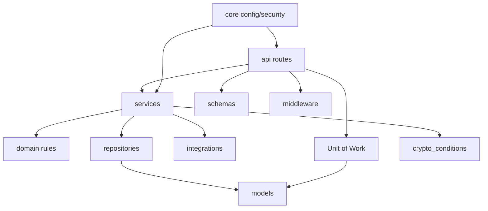

# Backend Application Modules

## Purpose

`backend/app` contains the FastAPI application, domain rules, persistence boundaries, integrations, and service logic for the locked RingLedger MVP.

## Directory Map

- `backend/app/api/README.md`: HTTP route layer and role/idempotency dependencies.
- `backend/app/core/README.md`: runtime settings and security helpers.
- `backend/app/crypto_conditions/README.md`: crypto-condition fulfillment helpers.
- `backend/app/db/README.md`: database sessions, startup policy, and Unit of Work.
- `backend/app/domain/README.md`: pure money and timing rules.
- `backend/app/integrations/README.md`: external service boundaries.
- `backend/app/middleware/README.md`: request guard helpers.
- `backend/app/models/README.md`: SQLAlchemy persistence model.
- `backend/app/repositories/README.md`: selective persistence access.
- `backend/app/schemas/README.md`: API request/response schemas.
- `backend/app/services/README.md`: lifecycle and business services.

## Diagrams

## Maintenance Notes

- Keep route handlers thin; lifecycle decisions belong in services.
- Keep `backend/app/domain` free of framework and database dependencies.
- Use the Unit of Work for write-path transaction ownership.
- Any API or lifecycle contract change must update `docs/api-spec.md`, `docs/state-machines.md`, and tests.

## Related Docs

- `backend/README.md`
- `docs/api-spec.md`
- `docs/state-machines.md`
- `docs/schema-doc.md`
- `docs/traceability-matrix.md`
