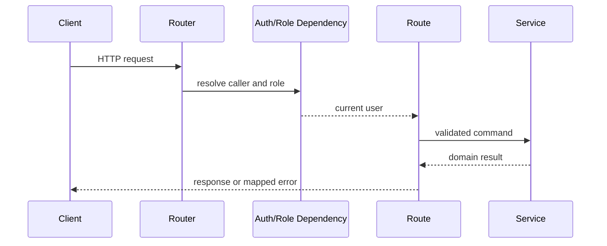

# API Routes

## Purpose

`backend/app/api` exposes RingLedger's HTTP surface. It owns request routing, authentication dependencies, role guards, idempotency header requirements, and conversion from service exceptions into stable HTTP responses.

## Directory Map

- `backend/app/api/router.py`: top-level API router composition.
- `backend/app/api/auth.py`: register/login endpoints.
- `backend/app/api/admin_users.py`: admin-only privileged account provisioning.
- `backend/app/api/fighters.py`: fighter profile endpoint.
- `backend/app/api/bouts.py`: `/bouts` router aggregation.
- `backend/app/api/dependencies.py`: authenticated-user and role dependencies.
- `backend/app/api/bouts_routes/README.md`: modular bout lifecycle route internals.

## Diagrams

## Maintenance Notes

- Keep route functions focused on HTTP concerns.
- Do not duplicate lifecycle logic in routes if a service owns it.
- Protected lifecycle routes must keep backend role checks authoritative.
- Confirm routes must enforce idempotency before service mutation.
- Confirm routes accept only escrow kind and transaction hash; XRPL evidence is fetched server-side.

## Related Docs

- `docs/api-spec.md`
- `docs/state-machines.md`
- `backend/app/services/README.md`
- `backend/tests/README.md`
