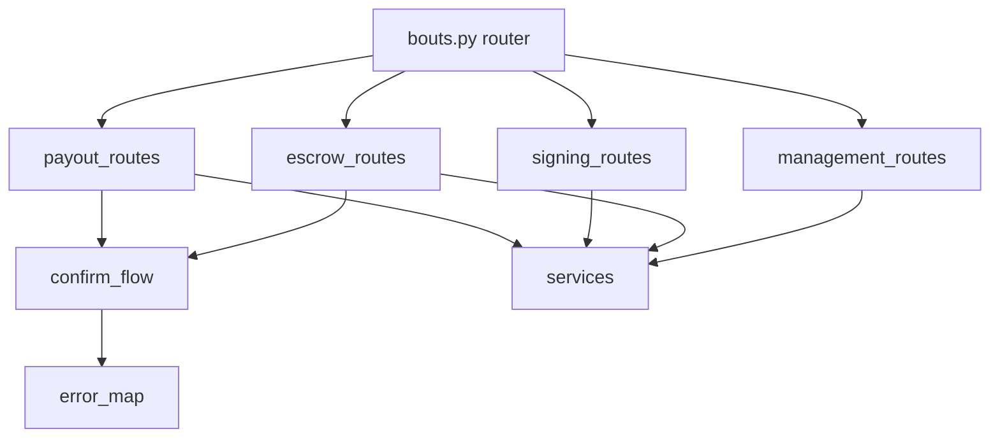

# Bout Route Modules

## Purpose

`backend/app/api/bouts_routes` keeps the `/bouts` route surface modular while preserving one coherent lifecycle contract for management, escrow creation, signing reconciliation, result entry, and payouts.

## Directory Map

- `backend/app/api/bouts_routes/management_routes.py`: draft bout create/list/detail.
- `backend/app/api/bouts_routes/escrow_routes.py`: escrow prepare and confirm.
- `backend/app/api/bouts_routes/signing_routes.py`: signing status reconciliation.
- `backend/app/api/bouts_routes/payout_routes.py`: result and payout prepare/confirm.
- `backend/app/api/bouts_routes/confirm_flow.py`: shared confirm helpers.
- `backend/app/api/bouts_routes/error_map.py`: service error to HTTP mapping.
- `backend/app/api/bouts_routes/http_utils.py`: shared response utilities.

## Diagrams

## Maintenance Notes

- Keep shared confirm behavior in `confirm_flow.py`.
- Keep deterministic failure-to-status mapping centralized in `error_map.py`.
- Route modules may orchestrate dependencies, but services remain lifecycle authorities.
- Any endpoint path or response shape change must update `docs/api-spec.md`.

## Related Docs

- `docs/api-spec.md`
- `docs/state-machines.md`
- `docs/operational-flow.md`
- `backend/app/services/README.md`
