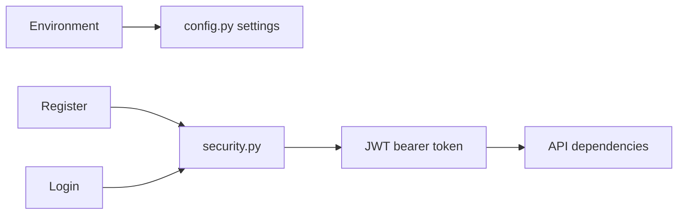

# Core Configuration And Security

## Purpose

`backend/app/core` contains cross-cutting runtime configuration and security primitives used by API dependencies and auth services.

## Directory Map

- `backend/app/core/config.py`: environment-backed settings.
- `backend/app/core/security.py`: password hashing and JWT encode/decode helpers.
- `backend/tests/unit/test_security.py`: security helper regression tests.
- `backend/tests/security/test_auth_mode_contract.py`: auth-mode boundary coverage.

## Diagrams

## Maintenance Notes

- Non-local deployments must provide a strong `JWT_SECRET`.
- Production rejects stub signing, wildcard CORS, startup migrations, non-Testnet XRPL identity, and missing/unsafe secrets.
- Secrets may be supplied through matching `_FILE` variables for container secret mounts.
- Do not add wallet-login or XRPL-address-login behavior here.
- Security helper changes need auth unit, contract, and security tests.
- Runtime settings should stay explicit and environment-driven.

## Related Docs

- `docs/auth-library-adoption-plan.md`
- `docs/api-spec.md`
- `docs/requirements-matrix.md`
- `backend/app/api/README.md`
