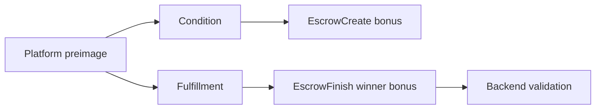

# Crypto Conditions

## Purpose

`backend/app/crypto_conditions` generates and verifies crypto-condition material for platform-controlled bonus escrow fulfillment.

## Directory Map

- `backend/app/crypto_conditions/fulfillment.py`: preimage, condition, and fulfillment helpers.
- `backend/tests/unit/test_crypto_conditions.py`: deterministic crypto-condition coverage.
- `backend/app/services/bout_service.py`: creates bonus escrow condition material.
- `backend/app/services/payout_service.py`: verifies winner-bonus fulfillment on payout.

## Diagrams

## Maintenance Notes

- The platform controls bonus fulfillment; promoter controls transaction signing.
- Never expose secret preimage material through API responses.
- Any encoding change must preserve XRPL validation expectations.
- Keep tests deterministic; avoid network calls.

## Related Docs

- `docs/state-machines.md`
- `docs/api-spec.md`
- `docs/requirements-matrix.md`
- `backend/app/services/README.md`
