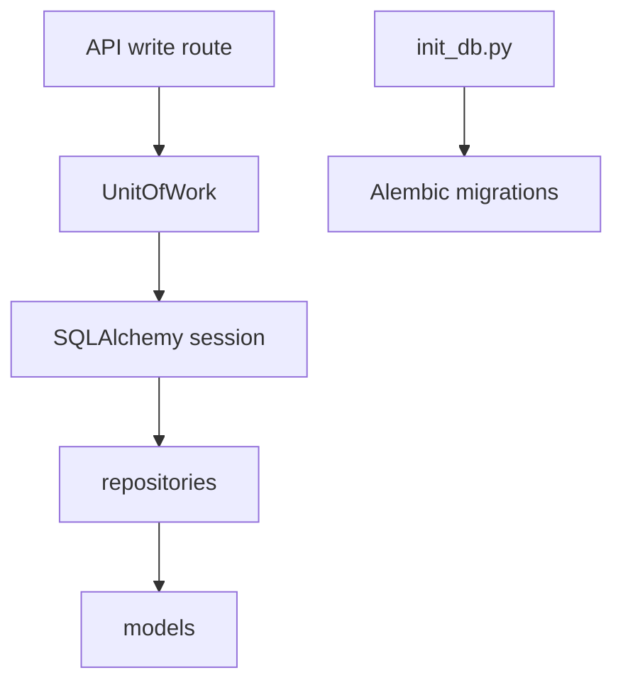

# Database Boundaries

## Purpose

`backend/app/db` owns database session wiring, startup migration policy, SQLAlchemy metadata loading, and the lightweight Unit of Work used by write flows.

## Directory Map

- `backend/app/db/session.py`: engine/session configuration.
- `backend/app/db/base.py`: SQLAlchemy model metadata imports.
- `backend/app/db/init_db.py`: startup migration policy.
- `backend/app/db/uow.py`: commit/rollback transaction boundary.
- `backend/tests/unit/test_uow.py`: UoW behavior tests.
- `backend/tests/unit/test_db_init.py`: startup migration policy tests.

## Diagrams

## Maintenance Notes

- Write routes should commit once through the Unit of Work.
- Production startup must not silently run unsafe migrations.
- Alembic remains authoritative for schema evolution.
- Keep database lifecycle behavior covered by unit and migration tests.

## Related Docs

- `docs/alembic-adoption-plan.md`
- `docs/clean-architecture-refactor-plan.md`
- `docs/schema-doc.md`
- `backend/app/repositories/README.md`
