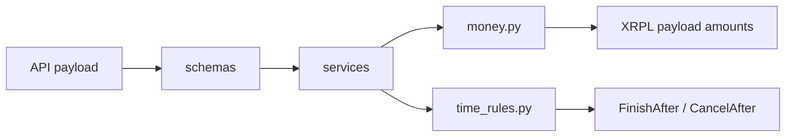

# Domain Rules

## Purpose

`backend/app/domain` contains pure business rules that do not know about FastAPI, SQLAlchemy, Xaman, or XRPL clients. These helpers are the safest place to maintain invariant logic that should be easy to unit and property test.

## Directory Map

- `backend/app/domain/money.py`: integer-drop money validation and conversion rules.
- `backend/app/domain/time_rules.py`: escrow finish/cancel timing rules and Ripple epoch conversion.
- `backend/tests/unit/test_money.py`: unit coverage for money helpers.
- `backend/tests/unit/test_time_rules.py`: unit coverage for timing helpers.
- `backend/tests/property/test_money_properties.py`: property-style money invariants.
- `backend/tests/property/test_time_rules_properties.py`: property-style timing invariants.

## Diagrams

## Maintenance Notes

- Keep this package deterministic and side-effect free.
- Do not import database models, FastAPI dependencies, or integration clients here.
- Changes to `FinishAfter`, `CancelAfter`, or drops behavior are contract changes and must update reference docs.
- Prefer broad property tests for numeric and time boundary behavior.

## Related Docs

- `docs/requirements-matrix.md`
- `docs/state-machines.md`
- `docs/schema-doc.md`
- `backend/app/services/README.md`
