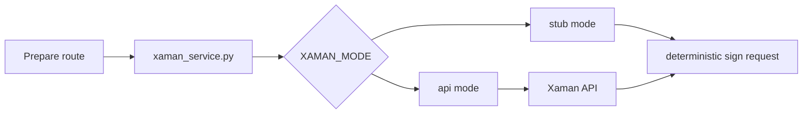

# Integrations

## Purpose

`backend/app/integrations` isolates external service calls behind explicit boundaries. Today that boundary is Xaman signing request and payload status behavior.

## Directory Map

- `backend/app/integrations/xaman_service.py`: Xaman stub/API modes and payload status lookup.
- `backend/tests/unit/test_xaman_service.py`: deterministic Xaman boundary coverage.
- `backend/app/services/signing_reconciliation_service.py`: consumes payload status outcomes.

## Diagrams

## Maintenance Notes

- Local and CI should use `XAMAN_MODE=stub`.
- `XAMAN_MODE=api` requires environment-managed `XAMAN_API_KEY` and `XAMAN_API_SECRET`.
- Keep external failures mapped to retry-safe route behavior.
- Do not let integration calls own lifecycle transitions.

## Related Docs

- `docs/xaman-signing-contract.md`
- `docs/operations-runbook.md`
- `docs/testnet-release-readiness.md`
- `backend/app/services/README.md`
