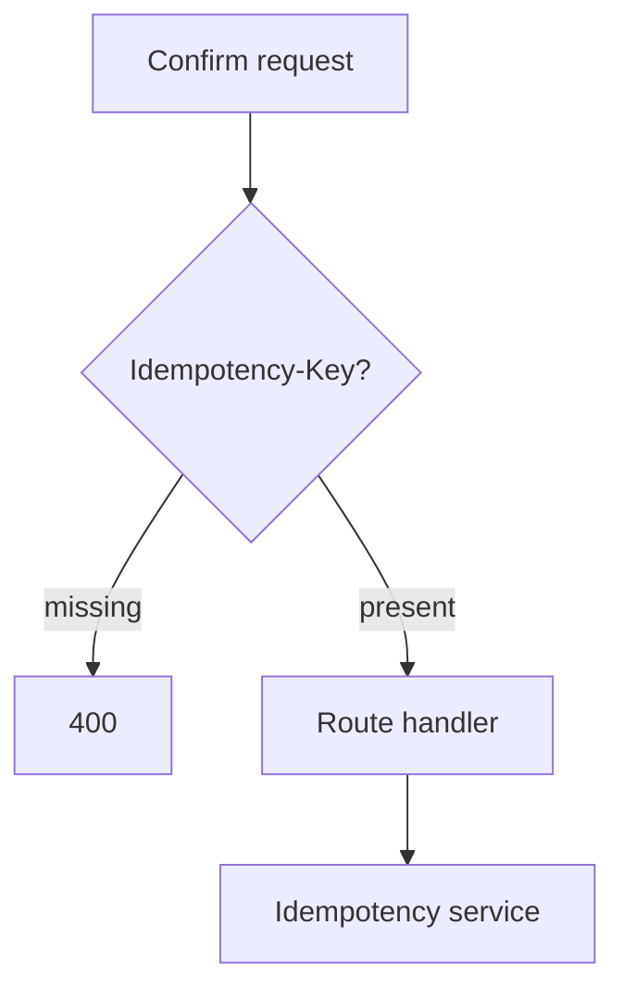

# Middleware And Request Guards

## Purpose

`backend/app/middleware` contains request guard helpers that protect HTTP-level invariants before service mutation.

## Directory Map

- `backend/app/middleware/idempotency.py`: `Idempotency-Key` enforcement helper.
- `backend/app/services/idempotency_service.py`: persistence-backed replay behavior.
- `backend/tests/security/test_confirm_idempotency_contract.py`: confirm idempotency contract tests.

## Diagrams

## Maintenance Notes

- Keep middleware helpers HTTP-focused.
- Idempotency replay semantics belong in `backend/app/services/idempotency_service.py`.
- Confirm endpoints must reject missing idempotency keys before mutation.
- Do not broaden idempotency behavior without security tests.

## Related Docs

- `docs/api-spec.md`
- `docs/state-machines.md`
- `backend/app/services/README.md`
- `backend/tests/README.md`
