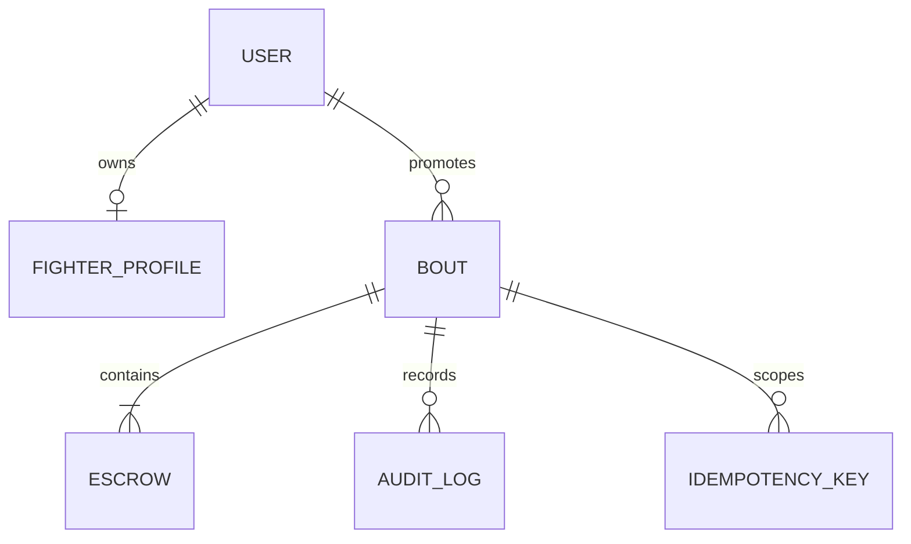

# Persistence Models

## Purpose

`backend/app/models` defines the SQLAlchemy representation of users, fighter profiles, bouts, escrows, idempotency keys, and audit logs.

## Directory Map

- `backend/app/models/user.py`: authenticated user and role storage.
- `backend/app/models/fighter_profile.py`: fighter profile and XRPL address.
- `backend/app/models/bout.py`: bout lifecycle aggregate root.
- `backend/app/models/escrow.py`: escrow lifecycle records.
- `backend/app/models/idempotency_key.py`: confirm replay storage.
- `backend/app/models/audit_log.py`: transition/failure audit trail.
- `backend/app/models/enums.py`: persisted enum values.

## Diagrams

## Maintenance Notes

- Schema changes must flow through Alembic.
- Keep enum values stable unless migrations and docs are updated.
- Models should not contain business workflows; services own lifecycle behavior.
- Update `docs/schema-doc.md` for schema-relevant changes.

## Related Docs

- `docs/schema-doc.md`
- `docs/state-machines.md`
- `docs/alembic-adoption-plan.md`
- `backend/app/repositories/README.md`
