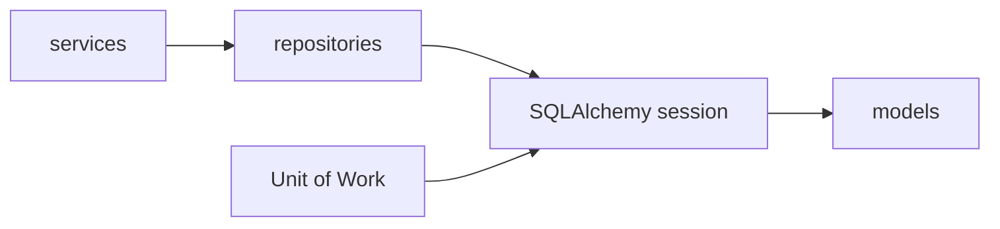

# Repositories

## Purpose

`backend/app/repositories` provides selective data-access helpers where repeated query or persistence logic would otherwise spread across services.

## Directory Map

- `backend/app/repositories/bout_repository.py`: bout loading and role-scoped retrieval.
- `backend/app/repositories/escrow_repository.py`: escrow lookup helpers.
- `backend/app/repositories/fighter_profile_repository.py`: fighter profile persistence.
- `backend/app/repositories/idempotency_key_repository.py`: idempotency key storage.
- `backend/app/repositories/audit_log_repository.py`: audit entry persistence.
- `backend/tests/unit/test_persistence_repositories.py`: repository coverage.

## Diagrams

## Maintenance Notes

- Avoid generic repository-per-table CRUD abstractions.
- Add repository methods only when they reduce real duplication or clarify ownership.
- Repositories should not make lifecycle decisions.
- Keep transaction ownership external through `backend/app/db/uow.py`.

## Related Docs

- `docs/clean-architecture-refactor-plan.md`
- `backend/app/db/README.md`
- `backend/app/models/README.md`
- `backend/app/services/README.md`
