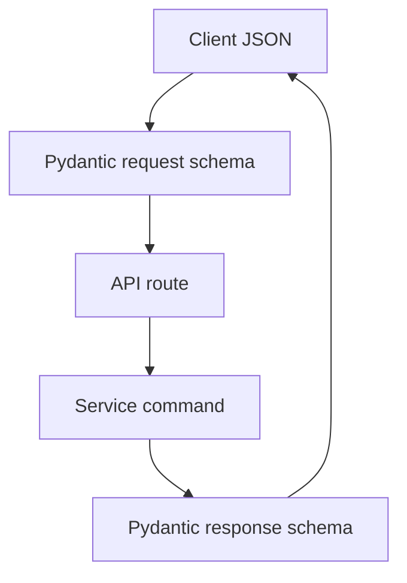

# API Schemas

## Purpose

`backend/app/schemas` contains Pydantic request and response contracts for the public API and internal route/service boundaries.

## Directory Map

- `backend/app/schemas/auth.py`: auth request/response schemas.
- `backend/app/schemas/fighter.py`: fighter profile schemas.
- `backend/app/schemas/bout.py`: bout management schemas.
- `backend/app/schemas/escrow.py`: escrow prepare/confirm schemas.
- `backend/app/schemas/payout.py`: result and payout schemas.
- `backend/app/schemas/signing.py`: signing reconciliation schemas.
- `backend/app/schemas/xaman.py`: Xaman sign-request envelope schemas.

## Diagrams

## Maintenance Notes

- Schema changes are API contract changes unless strictly internal.
- Keep examples in `docs/api-spec.md` synchronized with schema changes.
- Validate edge cases through contract tests.
- Do not encode lifecycle authority in schemas; services validate state.

## Related Docs

- `docs/api-spec.md`
- `backend/app/api/README.md`
- `backend/tests/README.md`
- `frontend/src/api/README.md`
