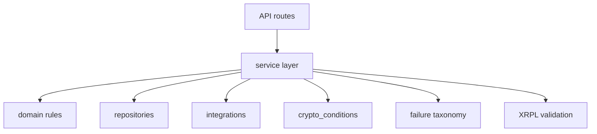

# Services

## Purpose

`backend/app/services` owns business workflows, lifecycle transitions, validation orchestration, failure classification, and integration coordination.

## Directory Map

- `backend/app/services/auth_service.py`: account registration and login.
- `backend/app/services/fighter_profile_service.py`: fighter profile upsert rules.
- `backend/app/services/bout_service.py`: bout draft creation and escrow planning.
- `backend/app/services/escrow_service.py`: escrow create confirmation lifecycle.
- `backend/app/services/payout_service.py`: result and payout lifecycle.
- `backend/app/services/signing_reconciliation_service.py`: Xaman payload status persistence.
- `backend/app/services/idempotency_service.py`: confirm replay/collision behavior.
- `backend/app/services/failure_taxonomy.py`: deterministic failure classification.
- `backend/app/services/xrpl_escrow_service.py`: XRPL payload building and validation.

## Diagrams

## Maintenance Notes

- Services are lifecycle authorities; keep state transitions here.
- Preserve no-transition behavior for signing, confirmation, and validation failures.
- Keep idempotent replay behavior stable for confirm endpoints.
- Add integration/security/contract tests when service behavior changes.

## Related Docs

- `docs/state-machines.md`
- `docs/api-spec.md`
- `docs/operational-flow.md`
- `backend/app/domain/README.md`
