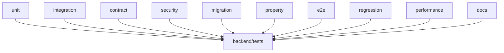

# Backend Tests

## Purpose

`backend/tests` proves RingLedger's domain rules, API contracts, lifecycle guards, migration policy, frontend-consumer expectations, operational hardening, and documentation structure.

## Directory Map

- `backend/tests/unit/`: pure unit coverage for services, helpers, repositories, and security.
- `backend/tests/integration/`: route/service integration flows.
- `backend/tests/contract/`: API contract assertions.
- `backend/tests/security/`: auth, role, and idempotency guard coverage.
- `backend/tests/migration/`: schema and Alembic governance.
- `backend/tests/property/`: broader domain invariant checks.
- `backend/tests/e2e/`: backend-driven promoter/admin journeys.
- `backend/tests/regression/`: stable failure taxonomy expectations.
- `backend/tests/performance/`: deterministic M4 performance baselines.
- `backend/tests/docs/`: module README and documentation path validation.

## Diagrams

## Maintenance Notes

- Add the narrowest useful test first, then broaden when shared behavior changes.
- Contract/lifecycle changes should usually touch integration, contract, and security tests.
- Documentation moves must keep `backend/tests/docs` green.
- Full suite command: `.\venv\Scripts\python.exe -m pytest backend/tests -q`.

## Related Docs

- `docs/ci-cd.md`
- `docs/traceability-matrix.md`
- `backend/app/README.md`
- `frontend/src/README.md`
