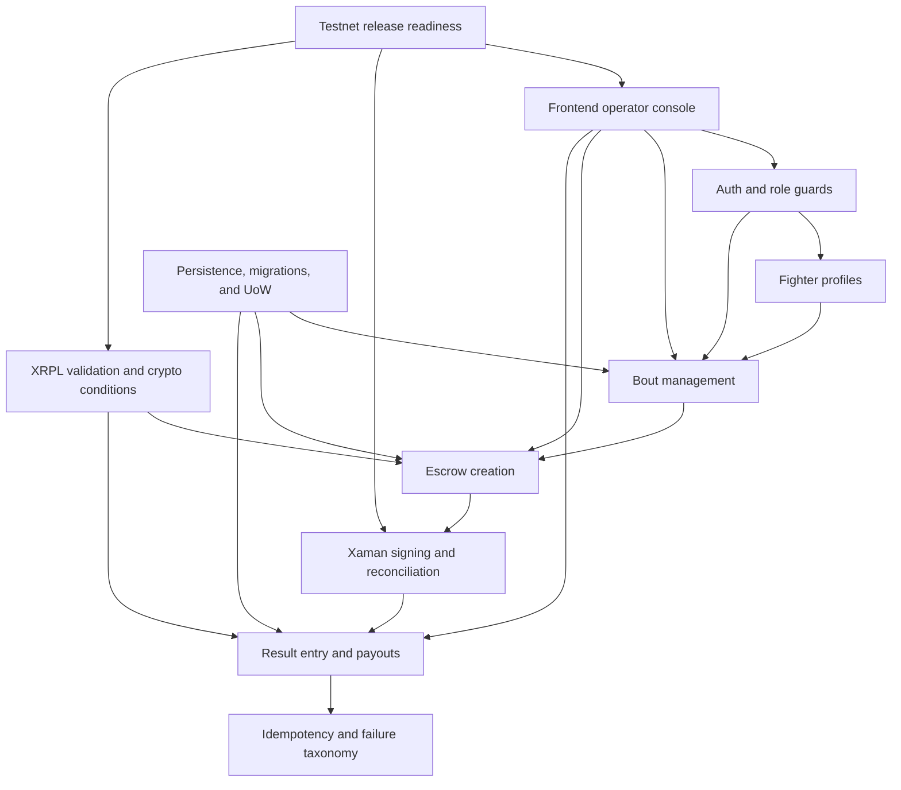

# RingLedger Feature Documentation

This directory is the maintainer entry point for RingLedger's locked MVP features. Each feature README summarizes how a capability works across source files, tests, operations, and canonical reference docs.

The reference docs remain authoritative:

- API contracts: `docs/api-spec.md`
- Lifecycle contracts: `docs/state-machines.md`
- Schema contracts: `docs/schema-doc.md`
- Operational procedures: `docs/operations-runbook.md`
- Requirement traceability: `docs/traceability-matrix.md`

## Feature Map

## Feature READMEs

| Feature | README |
|---|---|
| Auth and role guards | `docs/features/auth-and-role-guards/README.md` |
| Fighter profiles | `docs/features/fighter-profiles/README.md` |
| Bout management | `docs/features/bout-management/README.md` |
| Escrow creation | `docs/features/escrow-creation/README.md` |
| Xaman signing and reconciliation | `docs/features/xaman-signing-reconciliation/README.md` |
| Result entry and payouts | `docs/features/result-entry-payouts/README.md` |
| Idempotency and failure taxonomy | `docs/features/idempotency-failure-taxonomy/README.md` |
| XRPL validation and crypto conditions | `docs/features/xrpl-validation-crypto-conditions/README.md` |
| Persistence, migrations, and Unit of Work | `docs/features/persistence-migrations-uow/README.md` |
| Frontend operator console | `docs/features/frontend-operator-console/README.md` |
| Testnet release readiness | `docs/features/testnet-release-readiness/README.md` |

## Maintenance Rules

- Keep feature READMEs concise and maintainer-focused.
- Link to canonical docs instead of restating full contracts.
- Keep diagrams as Mermaid code blocks in Markdown.
- Update the validation test when adding or removing a required feature README.
