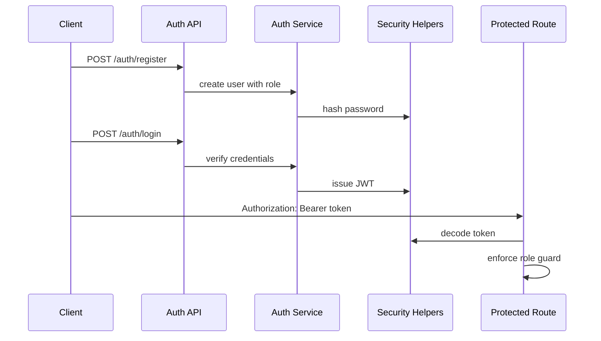

# Auth And Role Guards

## Purpose

Auth keeps the MVP bounded to email/password login plus JWT bearer tokens. Role guards make the backend authoritative for promoter, admin, and fighter permissions.

## Maintainer Map

- Routes: `backend/app/api/auth.py`, `backend/app/api/dependencies.py`
- Services: `backend/app/services/auth_service.py`
- Security helpers: `backend/app/core/security.py`
- Schemas/models: `backend/app/schemas/auth.py`, `backend/app/models/user.py`
- Frontend workflow: `frontend/src/hooks/useAuthWorkflow.ts`, `frontend/src/components/AuthPanel.tsx`

## Runtime Flow

1. User registers through `POST /auth/register`.
2. User logs in through `POST /auth/login`.
3. Backend issues a JWT with role claims.
4. Protected routes resolve the caller and enforce role-specific dependencies.

## Key Invariants

- Wallet login is not supported.
- JWT is the only session credential accepted by protected routes.
- Backend role checks are authoritative; frontend state is advisory.
- Password hashing and JWT handling use maintained libraries.

## Diagrams

## Tests

- `backend/tests/unit/test_security.py`
- `backend/tests/unit/test_api_dependencies_auth.py`
- `backend/tests/contract/test_auth_api_contract.py`
- `backend/tests/security/test_auth_mode_contract.py`
- `backend/tests/security/test_bout_role_guards.py`
- `frontend/src/App.test.tsx`

## Operational Notes

- Non-local environments must provide a strong `JWT_SECRET_KEY`.
- Failed auth should not reveal whether an email or password was incorrect.
- Role mismatches should return deterministic authorization errors.

## Canonical References

- `docs/api-spec.md`
- `docs/requirements-matrix.md`
- `docs/auth-library-adoption-plan.md`
- `docs/state-machines.md`
