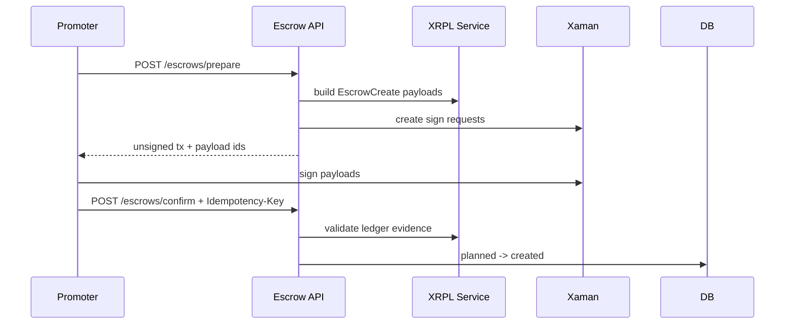

# Escrow Creation

## Purpose

Escrow creation prepares Xaman-signed XRPL `EscrowCreate` payloads and confirms validated ledger evidence before transitioning planned escrows to created.

## Maintainer Map

- Routes: `backend/app/api/bouts_routes/escrow_routes.py`, `backend/app/api/bouts_routes/confirm_flow.py`
- Services: `backend/app/services/escrow_service.py`, `backend/app/services/xrpl_escrow_service.py`
- Schemas: `backend/app/schemas/escrow.py`, `backend/app/schemas/xaman.py`
- Frontend workflow: `frontend/src/hooks/useEscrowWorkflow.ts`, `frontend/src/components/EscrowFlowPanel.tsx`

## Runtime Flow

1. Promoter calls escrow prepare for a draft bout.
2. Backend builds four unsigned `EscrowCreate` payloads and Xaman sign requests.
3. Promoter signs externally in Xaman.
4. Promoter confirms each ledger result with an idempotency key.
5. Backend validates `tesSUCCESS`, expected fields, and offer sequences.
6. Bout moves to `escrows_created` after all four escrows are created.

## Key Invariants

- Prepare does not change lifecycle state.
- Confirm requires validated XRPL `tesSUCCESS` evidence.
- Confirm requires `Idempotency-Key`.
- State transitions are all-or-guarded, never optimistic.

## Diagrams

## Tests

- `backend/tests/contract/test_bout_escrow_api_contract.py`
- `backend/tests/integration/test_escrow_confirm_flow.py`
- `backend/tests/security/test_confirm_idempotency_contract.py`
- `backend/tests/e2e/test_promoter_signing_flow.py`
- `frontend/e2e/promoter-flow.spec.ts`

## Operational Notes

- `502` during prepare usually means signing integration degradation.
- `422` during confirm means no transition was applied; use the returned failure code.
- A mismatched idempotency replay returns `409`.

## Canonical References

- `docs/api-spec.md`
- `docs/state-machines.md`
- `docs/xaman-signing-contract.md`
- `docs/operations-runbook.md`
