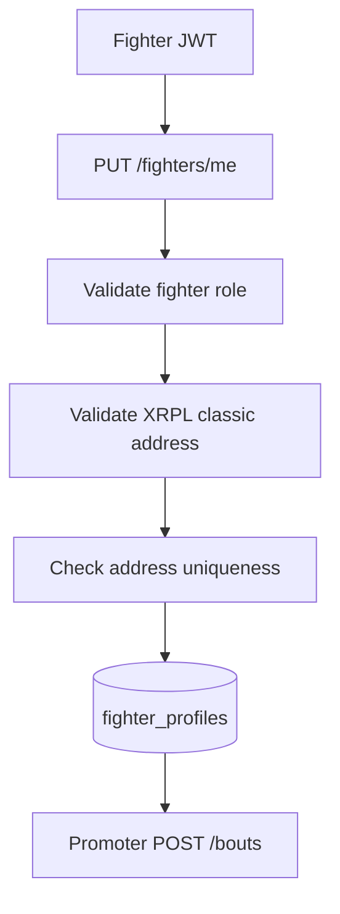

# Fighter Profiles

## Purpose

Fighter profiles bind authenticated fighter users to display names and XRPL Testnet destination addresses used when promoters create bouts.

## Maintainer Map

- Route: `backend/app/api/fighters.py`
- Service: `backend/app/services/fighter_profile_service.py`
- Repository: `backend/app/repositories/fighter_profile_repository.py`
- Model/schema: `backend/app/models/fighter_profile.py`, `backend/app/schemas/fighter.py`
- Frontend workflow: `frontend/src/hooks/useManagementWorkflow.ts`, `frontend/src/components/BoutWorkspacePanel.tsx`

## Runtime Flow

1. Fighter authenticates with a fighter role JWT.
2. Fighter calls `PUT /fighters/me` with display name and XRPL classic address.
3. Backend validates role, payload, and address uniqueness.
4. Promoter bout creation later resolves both fighter profiles.

## Key Invariants

- Only fighter users can update their own fighter profile.
- XRPL addresses must be unique across fighter profiles.
- Bout creation requires distinct fighter users with profile addresses.
- Profile writes must not partially persist invalid bout setup.

## Diagrams

## Tests

- `backend/tests/contract/test_fighter_profile_api_contract.py`
- `backend/tests/integration/test_management_endpoints.py`
- `frontend/src/App.test.tsx`
- `frontend/e2e/promoter-flow.spec.ts`

## Operational Notes

- Address conflicts indicate a data ownership issue, not a retryable integration failure.
- Release smoke validation should use funded XRPL Testnet addresses controlled outside the repository.

## Canonical References

- `docs/api-spec.md`
- `docs/schema-doc.md`
- `docs/traceability-matrix.md`
- `docs/testnet-release-readiness.md`
