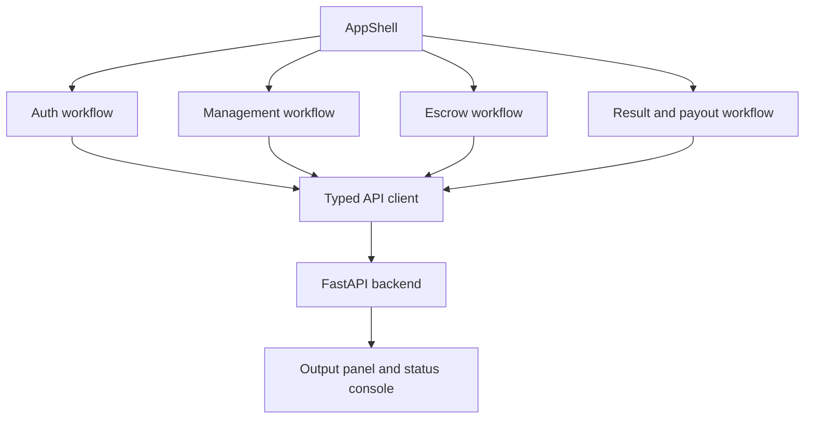

# Frontend Operator Console

## Purpose

The React frontend provides a role-scoped operator console for executing and inspecting the locked MVP workflows while leaving lifecycle authority in the backend.

## Maintainer Map

- Shell: `frontend/src/app/AppShell.tsx`
- Workflow composition: `frontend/src/hooks/useRingLedgerConsole.ts`
- API client: `frontend/src/api/client.ts`, `frontend/src/api/types.ts`
- Panels: `frontend/src/components/AuthPanel.tsx`, `frontend/src/components/BoutWorkspacePanel.tsx`, `frontend/src/components/EscrowFlowPanel.tsx`, `frontend/src/components/PayoutFlowPanel.tsx`
- E2E runner: `frontend/scripts/run-e2e.mjs`, `frontend/playwright.config.ts`

## Runtime Flow

1. User authenticates as promoter/admin/fighter according to workflow.
2. Console panels call typed API client functions.
3. Responses are rendered for operator inspection.
4. Browser E2E covers the main promoter/admin journey.

## Key Invariants

- Frontend never enforces lifecycle authority.
- API client should match backend contract shapes.
- E2E runner owns Vite startup and cleanup.
- UI must keep failure responses visible enough for operator action.

## Diagrams

## Tests

- `frontend/src/api/client.test.ts`
- `frontend/src/App.test.tsx`
- `frontend/e2e/promoter-flow.spec.ts`
- `backend/tests/e2e/test_promoter_signing_flow.py`

## Operational Notes

- `VITE_API_BASE_URL` selects the backend endpoint.
- `npm run test:e2e` starts and cleans up the managed Vite server.
- Local Playwright browser binaries must match the installed Playwright version.

## Canonical References

- `frontend/README.md`
- `docs/api-spec.md`
- `docs/operational-flow.md`
- `docs/ci-cd.md`
