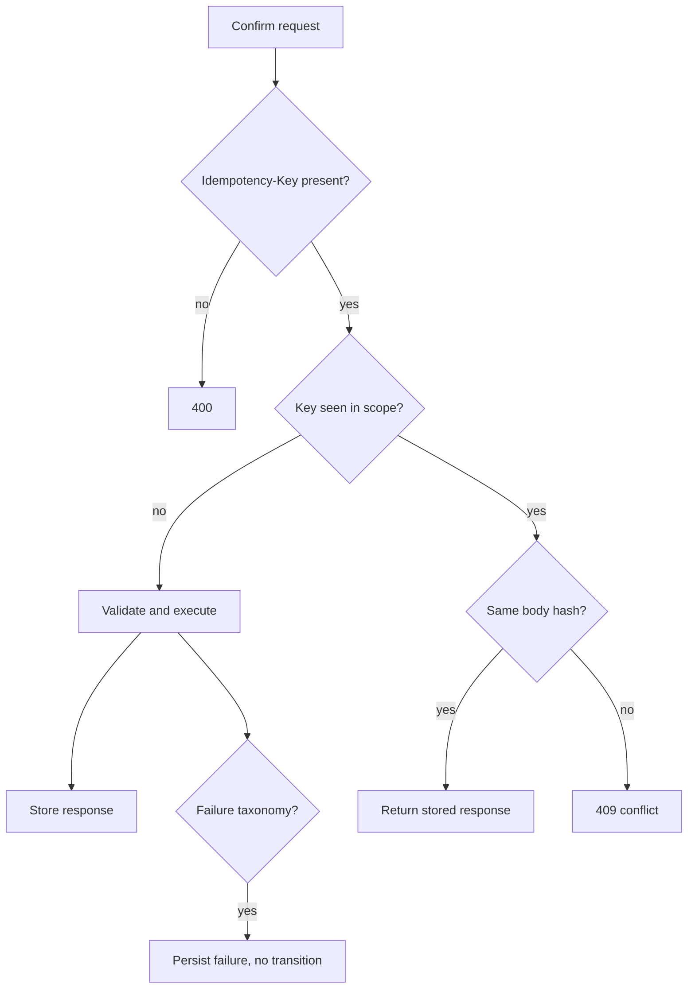

# Idempotency And Failure Taxonomy

## Purpose

Idempotency protects confirm endpoints from unsafe retries, while the failure taxonomy gives operators deterministic no-transition outcomes for signing and ledger failures.

## Maintainer Map

- Middleware: `backend/app/middleware/idempotency.py`
- Services: `backend/app/services/idempotency_service.py`, `backend/app/services/failure_taxonomy.py`
- Repository/model: `backend/app/repositories/idempotency_key_repository.py`, `backend/app/models/idempotency_key.py`
- Route mapping: `backend/app/api/bouts_routes/error_map.py`, `backend/app/api/bouts_routes/confirm_flow.py`

## Runtime Flow

1. Client sends confirm request with `Idempotency-Key`.
2. Backend hashes request payload within a confirm scope.
3. Same-key same-body replay returns the stored response.
4. Same-key different-body replay returns `409`.
5. Deterministic failures persist failure codes and do not transition lifecycle state.

## Key Invariants

- Confirm endpoints require idempotency keys.
- Idempotency scope includes the bout-specific operation type.
- Failed signing or invalid ledger evidence never advances state.
- Failure codes must remain stable for frontend/operator guidance.

## Diagrams

## Tests

- `backend/tests/unit/test_idempotency_service.py`
- `backend/tests/security/test_confirm_idempotency_contract.py`
- `backend/tests/regression/test_failure_taxonomy_regression.py`
- `backend/tests/integration/test_escrow_confirm_flow.py`
- `backend/tests/integration/test_payout_flow.py`

## Operational Notes

- Do not reuse an idempotency key for a changed request body.
- Treat `422` failure-code responses as authoritative no-transition outcomes.
- Treat `409` as a client replay bug or mutated retry intent.

## Canonical References

- `docs/api-spec.md`
- `docs/state-machines.md`
- `docs/operations-runbook.md`
- `docs/performance-regression-gates.md`
