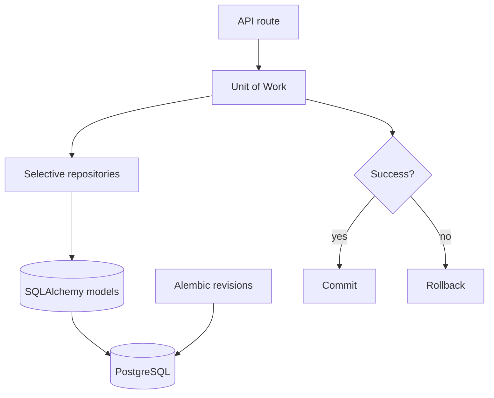

# Persistence, Migrations, And Unit Of Work

## Purpose

Persistence boundaries keep write flows atomic, while Alembic owns schema evolution and selective repositories reduce duplicated data-access logic.

## Maintainer Map

- Unit of Work: `backend/app/db/uow.py`
- Session/init: `backend/app/db/session.py`, `backend/app/db/init_db.py`
- Repositories: `backend/app/repositories/bout_repository.py`, `backend/app/repositories/escrow_repository.py`, `backend/app/repositories/audit_log_repository.py`
- Alembic: `backend/alembic.ini`, `backend/alembic/env.py`, `backend/alembic/versions/202602220000_baseline_schema.py`
- Schema baseline: `backend/sql/001_init_schema.sql`

## Runtime Flow

1. API route opens a write boundary.
2. Services and repositories load and mutate state inside that boundary.
3. Successful route completion commits once.
4. Failure rolls back without partial lifecycle persistence.
5. Schema changes flow through Alembic revisions.

## Key Invariants

- Alembic is authoritative for schema evolution.
- Production startup must not implicitly apply unsafe migrations.
- UoW owns transaction commit/rollback at route boundaries.
- Repositories are selective, not generic CRUD wrappers for every table.

## Diagrams

## Tests

- `backend/tests/unit/test_uow.py`
- `backend/tests/unit/test_persistence_repositories.py`
- `backend/tests/unit/test_db_init.py`
- `backend/tests/migration/test_alembic_baseline_contract.py`
- `backend/tests/migration/test_schema_sql_contract.py`

## Operational Notes

- Run `.\venv\Scripts\python.exe -m alembic -c backend/alembic.ini history` before release.
- Schema rollback requires controlled Alembic downgrade and API smoke verification.

## Canonical References

- `docs/alembic-adoption-plan.md`
- `docs/clean-architecture-refactor-plan.md`
- `docs/schema-doc.md`
- `docs/operations-runbook.md`
