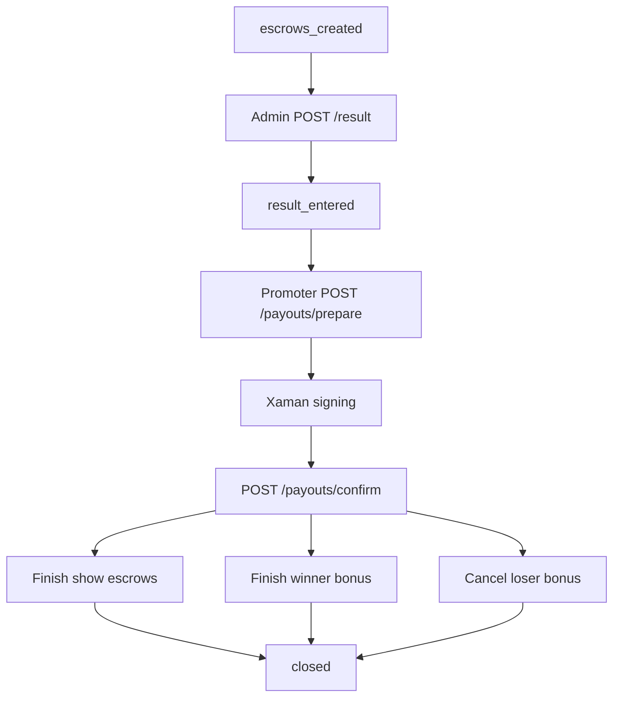

# Result Entry And Payouts

## Purpose

Result entry records the winner after escrow creation, and payout flows finish or cancel the four escrows according to the locked MVP lifecycle.

## Maintainer Map

- Routes: `backend/app/api/bouts_routes/payout_routes.py`, `backend/app/api/bouts_routes/confirm_flow.py`
- Services: `backend/app/services/payout_service.py`, `backend/app/services/xrpl_escrow_service.py`
- Schemas: `backend/app/schemas/payout.py`, `backend/app/schemas/signing.py`
- Frontend workflow: `frontend/src/hooks/useResultPayoutWorkflow.ts`, `frontend/src/components/ResultEntryPanel.tsx`, `frontend/src/components/PayoutFlowPanel.tsx`

## Runtime Flow

1. Admin enters winner after all escrows are created.
2. Promoter prepares payout transactions.
3. Backend builds `EscrowFinish` and `EscrowCancel` payloads.
4. Promoter signs in Xaman and optionally reconciles signing status.
5. Promoter confirms each payout with validated ledger evidence.
6. Bout closes when required payout completion criteria are met.

## Key Invariants

- Only admin can enter results.
- Result entry is immutable after payout starts.
- Winner bonus is finished with platform-controlled fulfillment.
- Loser bonus is cancelled after the configured cancel window.
- Payout confirm requires idempotency and ledger validation.

## Diagrams

## Tests

- `backend/tests/integration/test_payout_flow.py`
- `backend/tests/security/test_bout_role_guards.py`
- `backend/tests/contract/test_bout_escrow_api_contract.py`
- `backend/tests/e2e/test_promoter_signing_flow.py`
- `frontend/src/App.test.tsx`
- `frontend/e2e/promoter-flow.spec.ts`

## Operational Notes

- Timing guards apply before payout confirmation.
- `tec/tem` and invalid confirmation failures must not advance state.
- Payout release smoke requires funded Testnet accounts and ledger transaction hashes.

## Canonical References

- `docs/api-spec.md`
- `docs/state-machines.md`
- `docs/operational-flow.md`
- `docs/operations-runbook.md`
