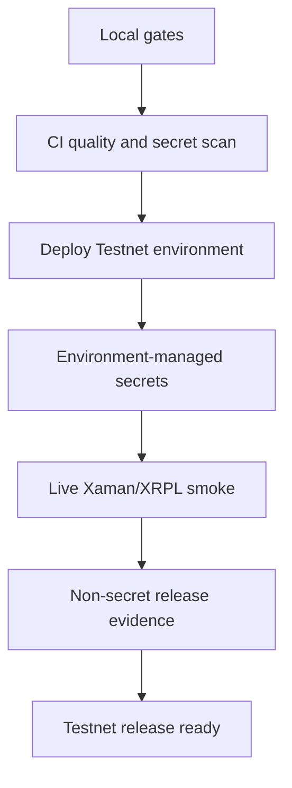

# Testnet Release Readiness

## Purpose

Testnet release readiness turns completed M4 hardening into deployable XRPL Testnet release evidence without expanding the locked MVP scope.

## Maintainer Map

- Release memo: `docs/testnet-release-readiness.md`
- Runbook: `docs/operations-runbook.md`
- CI/CD docs: `docs/ci-cd.md`
- Active change: `openspec/changes/prepare-testnet-release/tasks.md`
- Frontend package: `frontend/README.md`

## Runtime Flow

1. Deterministic backend and frontend gates pass locally and in CI.
2. Deployment environment provides non-repo secrets.
3. Operator runs live Xaman API and XRPL Testnet smoke validation.
4. Operator records non-secret payload IDs, transaction hashes, and summaries.
5. Release evidence is updated after live smoke completion.

## Key Invariants

- Testnet release readiness is not mainnet readiness.
- Live Xaman/XRPL checks are operator-run, not required for deterministic CI.
- Secrets must never be committed or captured in evidence.
- Locked MVP scope remains unchanged.

## Diagrams

## Tests

- `backend/tests/performance/test_m4_performance_baseline.py`
- `backend/tests/regression/test_failure_taxonomy_regression.py`
- `frontend/e2e/promoter-flow.spec.ts`
- `backend/tests/e2e/test_promoter_signing_flow.py`

## Operational Notes

- Required live variables include `XAMAN_MODE=api`, `XAMAN_API_KEY`, `XAMAN_API_SECRET`, and a strong `JWT_SECRET_KEY`.
- Evidence may include Xaman payload IDs and XRPL transaction hashes.
- Evidence must not include credentials, private keys, passwords, or seed material.

## Canonical References

- `docs/testnet-release-readiness.md`
- `docs/operations-runbook.md`
- `docs/traceability-matrix.md`
- `openspec/changes/prepare-testnet-release/specs/testnet-release-readiness/spec.md`
