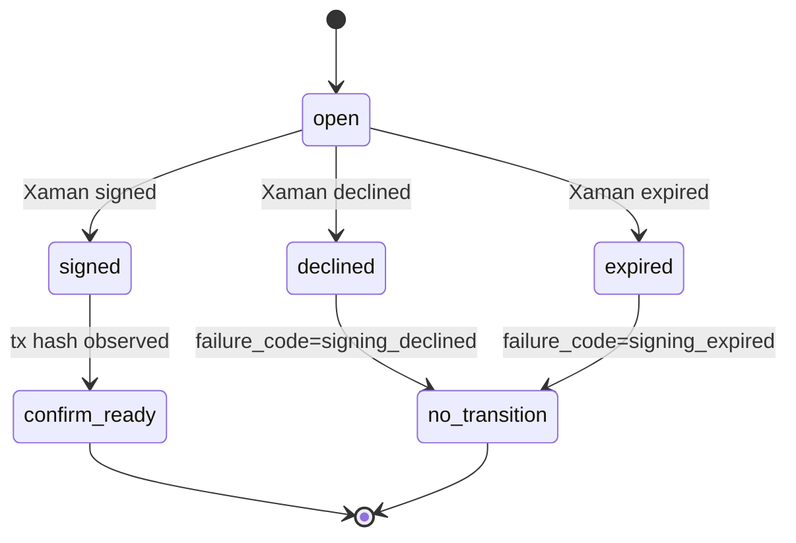

# Xaman Signing And Reconciliation

## Purpose

Xaman integration keeps promoter signing non-custodial. Prepare endpoints create sign-request metadata, and reconciliation records signing outcomes without applying lifecycle transitions.

## Maintainer Map

- Integration: `backend/app/integrations/xaman_service.py`
- Service: `backend/app/services/signing_reconciliation_service.py`
- Routes: `backend/app/api/bouts_routes/signing_routes.py`
- Schemas: `backend/app/schemas/signing.py`, `backend/app/schemas/xaman.py`
- Frontend workflow: `frontend/src/hooks/useEscrowWorkflow.ts`, `frontend/src/hooks/useResultPayoutWorkflow.ts`

## Runtime Flow

1. Prepare endpoint asks Xaman service for sign-request metadata.
2. Promoter signs or declines externally.
3. Reconcile endpoint reads observed Xaman payload status.
4. Backend persists failure classification metadata for declined/expired outcomes.
5. Confirm endpoint remains the only ledger-backed transition authority.

## Key Invariants

- Backend never stores promoter private keys.
- Reconciliation never moves bout or escrow lifecycle state forward.
- Stub mode remains deterministic for local and CI.
- API mode requires environment-managed Xaman credentials.

## Diagrams

## Tests

- `backend/tests/unit/test_xaman_service.py`
- `backend/tests/integration/test_escrow_confirm_flow.py`
- `backend/tests/integration/test_payout_flow.py`
- `backend/tests/e2e/test_promoter_signing_flow.py`
- `frontend/e2e/promoter-flow.spec.ts`

## Operational Notes

- Local and CI runs should use `XAMAN_MODE=stub`.
- Testnet release smoke validation uses `XAMAN_MODE=api`.
- Evidence may include payload IDs, but never API secrets.

## Canonical References

- `docs/xaman-signing-contract.md`
- `docs/operations-runbook.md`
- `docs/testnet-release-readiness.md`
- `docs/api-spec.md`
