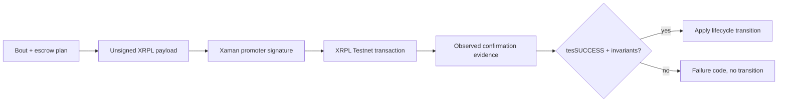

# XRPL Validation And Crypto Conditions

## Purpose

XRPL validation ensures lifecycle transitions happen only after confirmed ledger success, while crypto-condition helpers let the platform control winner-bonus fulfillment without taking promoter signing custody.

## Maintainer Map

- XRPL service: `backend/app/services/xrpl_escrow_service.py`
- Crypto helpers: `backend/app/crypto_conditions/fulfillment.py`
- Domain timing: `backend/app/domain/time_rules.py`
- Money model: `backend/app/domain/money.py`
- Escrow model: `backend/app/models/escrow.py`

## Runtime Flow

1. Backend builds unsigned XRPL escrow payloads from canonical bout/escrow state.
2. Promoter signs externally.
3. Confirm endpoints submit observed ledger evidence.
4. Backend validates `tesSUCCESS`, transaction type, owner, amount, offer sequence, timing, and fulfillment.
5. Only validated evidence can drive state transitions.

## Key Invariants

- Money values are integer drops.
- `FinishAfter` is event time plus two hours.
- Bonus `CancelAfter` is event time plus seven days.
- Platform controls bonus fulfillment preimage material.
- Ledger truth is required for state transitions.

## Diagrams

## Tests

- `backend/tests/unit/test_xrpl_escrow_service.py`
- `backend/tests/unit/test_crypto_conditions.py`
- `backend/tests/unit/test_money.py`
- `backend/tests/unit/test_time_rules.py`
- `backend/tests/property/test_money_properties.py`
- `backend/tests/property/test_time_rules_properties.py`

## Operational Notes

- `confirmation_timeout` means no optimistic transition.
- `ledger_tec_tem` requires investigation before retry.
- Invalid confirmation data should be rebuilt from canonical prepare output.

## Canonical References

- `docs/state-machines.md`
- `docs/schema-doc.md`
- `docs/api-spec.md`
- `docs/requirements-matrix.md`
