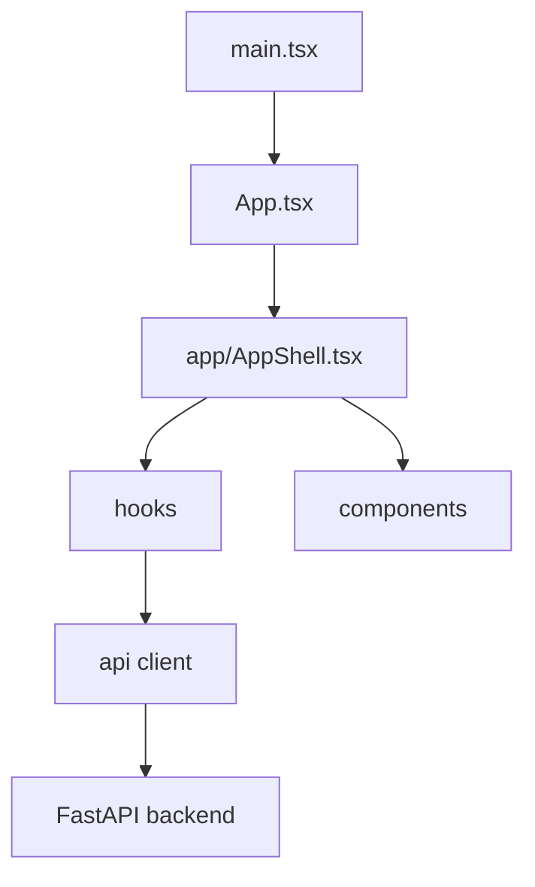

# Frontend Source

## Purpose

`frontend/src` implements the React operator console that exercises RingLedger's locked MVP workflows against the backend API while keeping lifecycle authority in the backend.

## Directory Map

- `frontend/src/api/README.md`: typed API client and response contracts.
- `frontend/src/app/README.md`: app shell and layout composition.
- `frontend/src/components/README.md`: workflow panels and output surfaces.
- `frontend/src/hooks/README.md`: workflow state and action orchestration.
- `frontend/src/auth.ts`: frontend auth state helpers.
- `frontend/src/constants.ts`: UI/runtime constants.
- `frontend/src/flow-utils.ts`: prepare-response extraction helpers.
- `frontend/src/styles.css`: console styling.

## Diagrams

## Maintenance Notes

- Keep backend lifecycle authority out of frontend state.
- Prefer typed API client changes over ad hoc `fetch` calls in components.
- Keep workflow hooks responsible for orchestration and components responsible for presentation.
- Browser E2E should continue to cover the operator journey.

## Related Docs

- `frontend/README.md`
- `frontend/src/api/README.md`
- `docs/api-spec.md`
- `docs/operational-flow.md`
