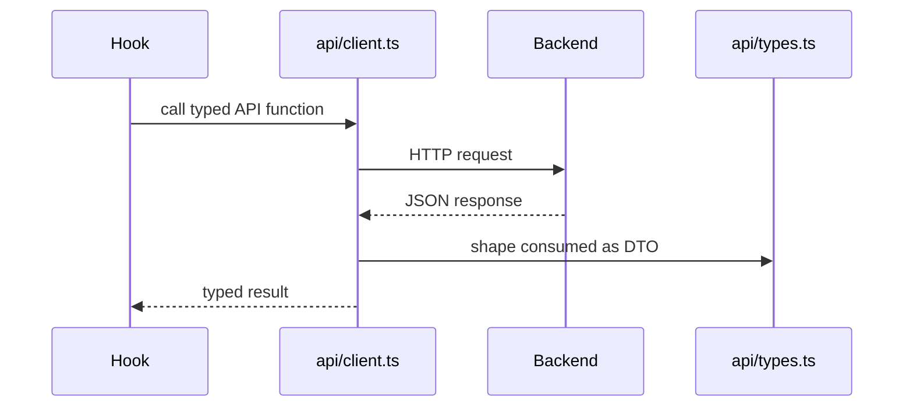

# Frontend API Client

## Purpose

`frontend/src/api` centralizes TypeScript request/response types and backend API calls used by the operator console.

## Directory Map

- `frontend/src/api/client.ts`: typed functions for auth, management, escrow, result, payout, and signing routes.
- `frontend/src/api/types.ts`: TypeScript DTOs matching backend response shapes.
- `frontend/src/api/client.test.ts`: client behavior and contract-oriented unit coverage.

## Diagrams

## Maintenance Notes

- Keep endpoint paths aligned with `docs/api-spec.md`.
- Add or update DTOs before wiring new UI workflow state.
- Do not bypass this client from panels unless there is a deliberate reason.
- Update `client.test.ts` for client contract changes.

## Related Docs

- `docs/api-spec.md`
- `frontend/src/hooks/README.md`
- `frontend/src/components/README.md`
- `frontend/README.md`
