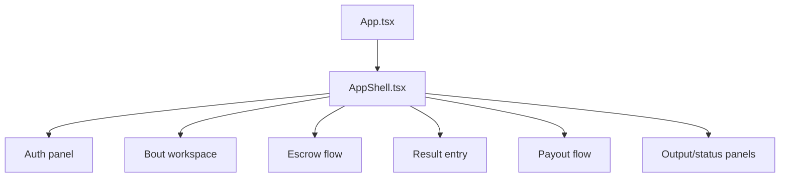

# Frontend App Shell

## Purpose

`frontend/src/app` owns the top-level console shell, route/path utility, high-level layout, runtime summary, and composition of workflow panels.

## Directory Map

- `frontend/src/app/AppShell.tsx`: masthead, runtime summary, workspace layout, output region.
- `frontend/src/app/usePathname.ts`: path utility for app-shell behavior.
- `frontend/src/App.tsx`: minimal app entry component outside this folder.

## Diagrams

## Maintenance Notes

- Keep shell concerns at the layout/composition level.
- Avoid moving API side effects into `AppShell.tsx`; workflow hooks own them.
- Check mobile and desktop layout when adding panels.
- Keep visible status/output areas useful for operator troubleshooting.

## Related Docs

- `frontend/src/hooks/README.md`
- `frontend/src/components/README.md`
- `frontend/README.md`
- `docs/operational-flow.md`
