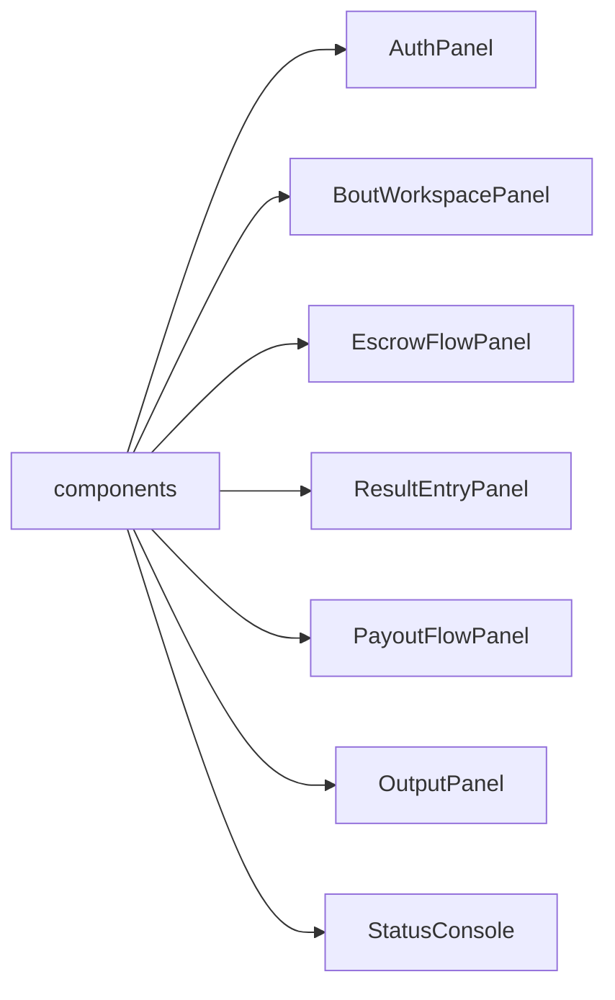

# Frontend Components

## Purpose

`frontend/src/components` contains the visual panels and output blocks used by the RingLedger operator console.

## Directory Map

- `frontend/src/components/AuthPanel.tsx`: register/login UI.
- `frontend/src/components/BoutWorkspacePanel.tsx`: fighter profile and bout management UI.
- `frontend/src/components/EscrowFlowPanel.tsx`: escrow prepare/reconcile/confirm UI.
- `frontend/src/components/ResultEntryPanel.tsx`: admin result entry UI.
- `frontend/src/components/PayoutFlowPanel.tsx`: payout prepare/reconcile/confirm UI.
- `frontend/src/components/OutputPanel.tsx`: response output rendering.
- `frontend/src/components/StatusConsole.tsx`: action/status log.
- `frontend/src/components/JsonBlock.tsx`: JSON display helper.

## Diagrams

## Maintenance Notes

- Components should receive workflow state/actions rather than own backend calls.
- Keep operator-facing failure and response output inspectable.
- Match compact console ergonomics; avoid marketing-style UI here.
- Update `frontend/src/App.test.tsx` and Playwright coverage when behavior changes.

## Related Docs

- `frontend/src/hooks/README.md`
- `frontend/src/app/README.md`
- `frontend/README.md`
- `docs/operational-flow.md`
