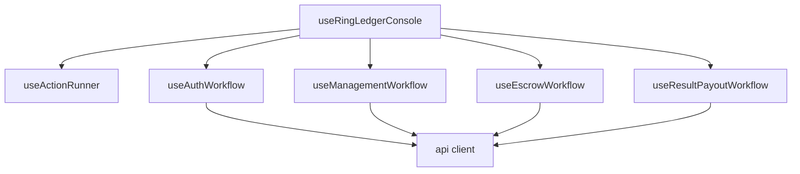

# Frontend Hooks

## Purpose

`frontend/src/hooks` owns workflow state machines for the operator console and coordinates calls through the typed API client.

## Directory Map

- `frontend/src/hooks/useRingLedgerConsole.ts`: top-level workflow composition.
- `frontend/src/hooks/useActionRunner.ts`: shared busy/error/status handling.
- `frontend/src/hooks/useAuthWorkflow.ts`: fighter registration, login, and admin provisioning state/actions.
- `frontend/src/hooks/useManagementWorkflow.ts`: fighter profile and bout workspace state.
- `frontend/src/hooks/useEscrowWorkflow.ts`: escrow prepare/reconcile/confirm state.
- `frontend/src/hooks/useResultPayoutWorkflow.ts`: admin result and payout flow state.

## Diagrams

## Maintenance Notes

- Hooks orchestrate side effects; panels render and trigger actions.
- Confirmation hooks send only escrow kind and transaction hash; they never derive ledger evidence from prepare payloads.
- Backend remains authoritative for role, lifecycle, timing, and ledger checks.
- Update hook tests through `frontend/src/App.test.tsx` when workflows change.

## Related Docs

- `frontend/src/api/README.md`
- `frontend/src/components/README.md`
- `docs/api-spec.md`
- `docs/state-machines.md`
